# DeployBatcher Feature Analysis

> Comprehensive analysis of the `DeployBatcher` class - a multi-agent deployment optimization system designed to reduce CI/CD pipeline minutes through intelligent batching, squashing, and parallel execution.

## Table of Contents

1. [Overview](#overview)
2. [Architecture](#architecture)
3. [Type System](#type-system)
4. [Class Diagram](#class-diagram)
5. [Core Features](#core-features)
6. [Data Flow](#data-flow)
7. [State Management](#state-management)
8. [CI/CD Optimization Strategies](#cicd-optimization-strategies)
9. [CLI Integration](#cli-integration)
10. [Usage Examples](#usage-examples)
11. [Performance Characteristics](#performance-characteristics)

---

## Overview

The `DeployBatcher` is a SQLite-backed deployment coordination system that optimizes CI/CD pipeline usage in multi-agent environments. It addresses a critical problem: when multiple AI agents work in parallel, they can trigger redundant CI/CD runs, consuming expensive pipeline minutes.

### Key Problem Solved

```
Without DeployBatcher:
  Agent A commits → CI Run 1 (5 min)
  Agent B commits → CI Run 2 (5 min)  
  Agent C commits → CI Run 3 (5 min)
  Agent A pushes → CI Run 4 (5 min)
  Total: 4 runs × 5 min = 20 CI minutes

With DeployBatcher:
  Agent A, B, C queue commits → Batched → Single squashed commit
  Single push → CI Run 1 (5 min)
  Total: 1 run × 5 min = 5 CI minutes (75% reduction)
```

---

## Architecture

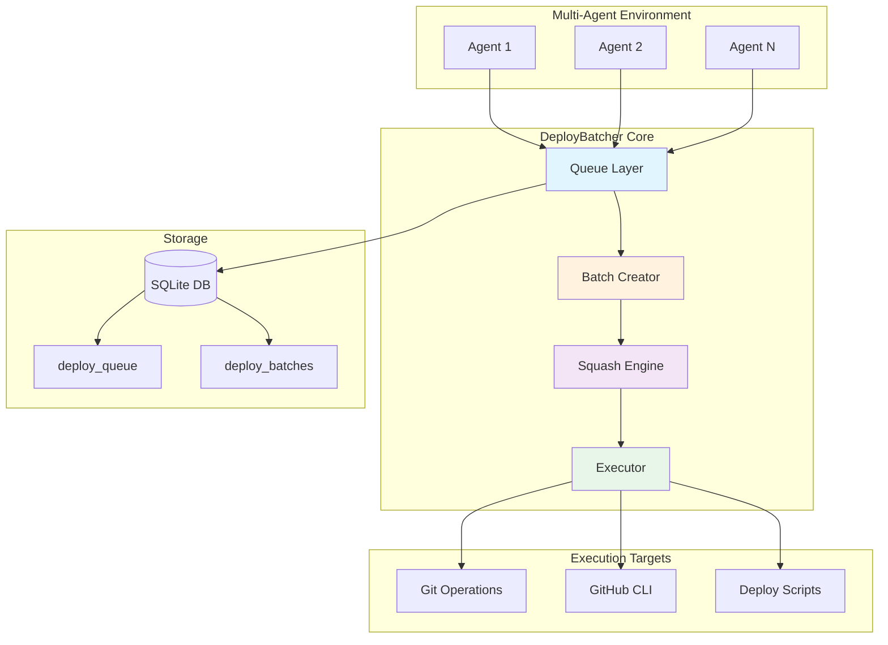

---

## Type System

### Core Types (from `types/coordination.ts`)

```typescript
// Action types that can be batched
type DeployActionType = 'commit' | 'push' | 'merge' | 'deploy' | 'workflow';

// Status lifecycle
type DeployStatus = 'pending' | 'batched' | 'executing' | 'completed' | 'failed';

// Single deploy action
interface DeployAction {
  id: number;
  agentId: string;
  actionType: DeployActionType;
  target: string;
  payload?: Record<string, unknown>;
  status: DeployStatus;
  batchId?: string;
  queuedAt: string;
  executeAfter?: string;
  priority: number;
  dependencies?: string[];
}

// Grouped batch
interface DeployBatch {
  id: string;           // UUID
  actions: DeployAction[];
  createdAt: string;
  status: DeployStatus;
}

// Execution result
interface BatchResult {
  batchId: string;
  success: boolean;
  executedActions: number;
  failedActions: number;
  errors?: string[];
  duration: number;     // milliseconds
}
```

### Configuration Interfaces

```typescript
// Dynamic window configuration (per action type)
interface DynamicBatchWindows {
  commit: number;    // Default: 30000ms (30s)
  push: number;      // Default: 5000ms (5s)
  merge: number;     // Default: 10000ms (10s)
  workflow: number;  // Default: 5000ms (5s)
  deploy: number;    // Default: 60000ms (60s)
}

// Batcher configuration
interface DeployBatcherConfig {
  dbPath?: string;
  batchWindowMs?: number;           // Legacy single window
  dynamicWindows?: Partial<DynamicBatchWindows>;
  maxBatchSize?: number;            // Default: 20
  dryRun?: boolean;
  parallelExecution?: boolean;      // Default: true
  maxParallelActions?: number;      // Default: 5
}
```

---

## Class Diagram

```mermaid
classDiagram
    class DeployBatcher {
        -db: Database
        -dynamicWindows: DynamicBatchWindows
        -maxBatchSize: number
        -dryRun: boolean
        -parallelExecution: boolean
        -maxParallelActions: number
        
        +constructor(config?: DeployBatcherConfig)
        +getBatchWindow(actionType): number
        +setUrgentMode(urgent: boolean): void
        +queue(agentId, actionType, target, payload?, options?): Promise~number~
        +queueBulk(agentId, actions): Promise~number[]~
        +createBatch(): Promise~DeployBatch|null~
        +executeBatch(batchId): Promise~BatchResult~
        +getBatch(batchId): DeployBatch|null
        +getPendingBatches(): DeployBatch[]
        +flushAll(): Promise~BatchResult[]~
        +getWindowConfig(): DynamicBatchWindows
        
        -queueSync(agentId, actionType, target, payload?, options?): number
        -findSimilarAction(actionType, target): DeployAction|null
        -canMerge(existing, incoming): boolean
        -mergeActions(existingId, newPayload?): Promise~void~
        -mergePayloads(existing, incoming): Record
        -groupByTarget(actions): Map
        -squashActions(grouped): DeployAction[]
        -squashCommits(commits): DeployAction
        -categorizeActions(actions): {sequential, parallel}
        -executeParallel(actions): Promise~Array~
        -executeAction(action): Promise~void~
        -executeCommit(target, payload): Promise~void~
        -executePush(target, payload): Promise~void~
        -executeMerge(target, payload): Promise~void~
        -executeWorkflow(target, payload): Promise~void~
        -executeDeploy(target, payload): Promise~void~
        -updateActionStatus(actionId, status): void
    }

    class CoordinationDatabase {
        -db: Database
        -instance: CoordinationDatabase$
        
        +getInstance(dbPath): CoordinationDatabase$
        +resetInstance(): void$
        +getDatabase(): Database
        +close(): void
        -initSchema(): void
    }

    class DeployAction {
        <<interface>>
        +id: number
        +agentId: string
        +actionType: DeployActionType
        +target: string
        +payload?: Record
        +status: DeployStatus
        +batchId?: string
        +queuedAt: string
        +executeAfter?: string
        +priority: number
        +dependencies?: string[]
    }

    class DeployBatch {
        <<interface>>
        +id: string
        +actions: DeployAction[]
        +createdAt: string
        +status: DeployStatus
    }

    class BatchResult {
        <<interface>>
        +batchId: string
        +success: boolean
        +executedActions: number
        +failedActions: number
        +errors?: string[]
        +duration: number
    }

    class DynamicBatchWindows {
        <<interface>>
        +commit: number
        +push: number
        +merge: number
        +workflow: number
        +deploy: number
    }

    DeployBatcher --> CoordinationDatabase : uses
    DeployBatcher --> DeployAction : manages
    DeployBatcher --> DeployBatch : creates
    DeployBatcher --> BatchResult : returns
    DeployBatcher --> DynamicBatchWindows : configures
    DeployBatch --> DeployAction : contains
```

---

## Core Features

### 1. Dynamic Batch Windows

Different action types have different time-sensitivity requirements:

| Action Type | Window | Rationale |
|-------------|--------|-----------|
| `push` | 5s | PRs need fast feedback |
| `workflow` | 5s | CI triggers should be responsive |
| `merge` | 10s | Moderate safety buffer |
| `commit` | 30s | Allows squashing multiple commits |
| `deploy` | 60s | Safety buffer for production |

```mermaid
gantt
    title Batch Window Timeline
    dateFormat X
    axisFormat %s

    section Push Actions
    Window (5s)     :0, 5

    section Workflow Actions
    Window (5s)     :0, 5

    section Merge Actions
    Window (10s)    :0, 10

    section Commit Actions
    Window (30s)    :0, 30

    section Deploy Actions
    Window (60s)    :0, 60
```

### 2. Action Merging & Deduplication

The batcher intelligently merges similar pending actions:

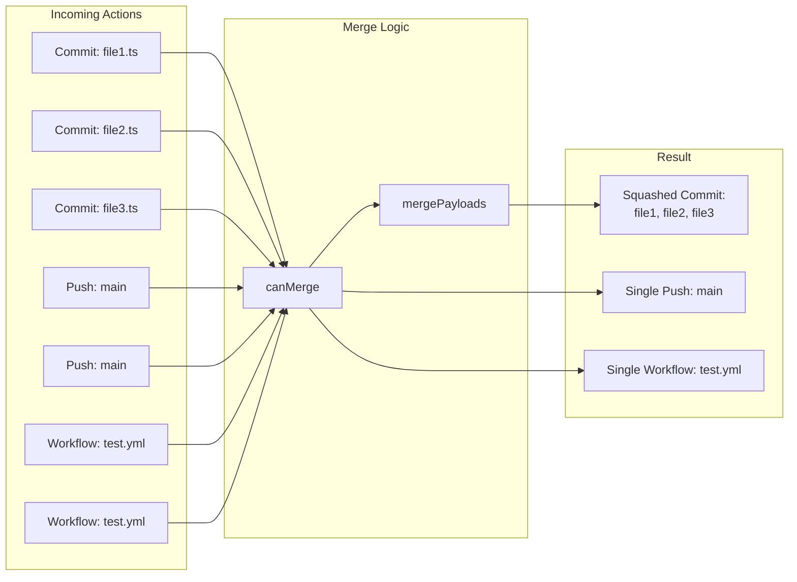

### 3. Commit Squashing

Multiple commits to the same target are squashed into one:

```typescript
// Input: 3 separate commits
[
  { message: "fix: typo in auth", files: ["src/auth.ts"] },
  { message: "feat: add logging", files: ["src/logger.ts"] },
  { message: "test: add auth tests", files: ["test/auth.test.ts"] }
]

// Output: Single squashed commit
{
  message: "Squashed 3 commits:\n\n1. fix: typo in auth\n2. feat: add logging\n3. test: add auth tests",
  files: ["src/auth.ts", "src/logger.ts", "test/auth.test.ts"],
  squashedFrom: [1, 2, 3]
}
```

### 4. Parallel Execution

Actions are categorized for parallel vs sequential execution:

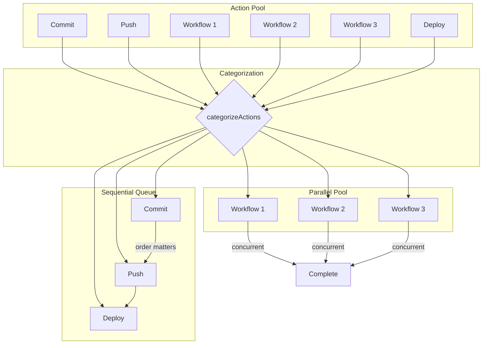

**Parallel-safe types**: `workflow` (no state dependencies)  
**Sequential types**: `commit`, `push`, `merge`, `deploy` (state-dependent)

### 5. Urgent Mode

For time-critical operations, urgent mode reduces all windows:

```typescript
// Normal mode
{ commit: 30000, push: 5000, merge: 10000, workflow: 5000, deploy: 60000 }

// Urgent mode
{ commit: 2000, push: 1000, merge: 2000, workflow: 1000, deploy: 5000 }
```

---

## Data Flow

### Queue → Batch → Execute Flow

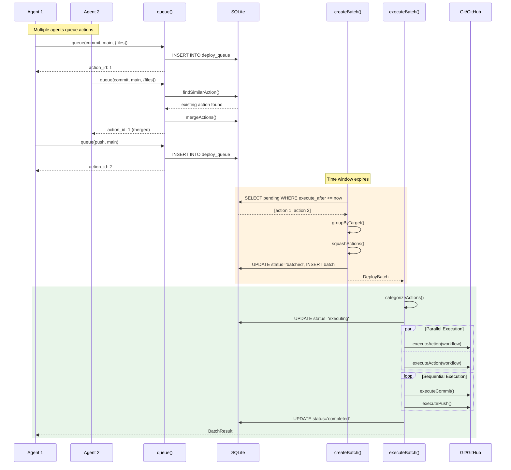

---

## State Management

### Action Status Lifecycle

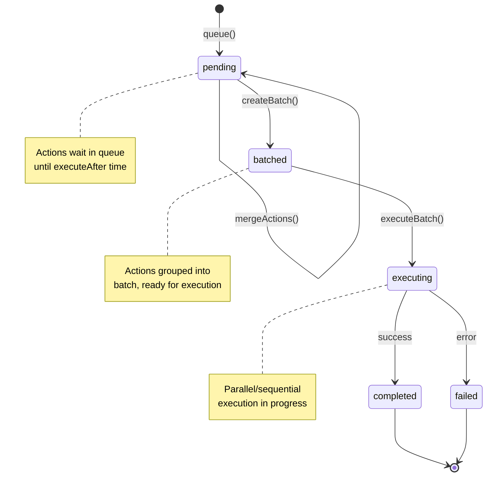

### Batch Status Lifecycle

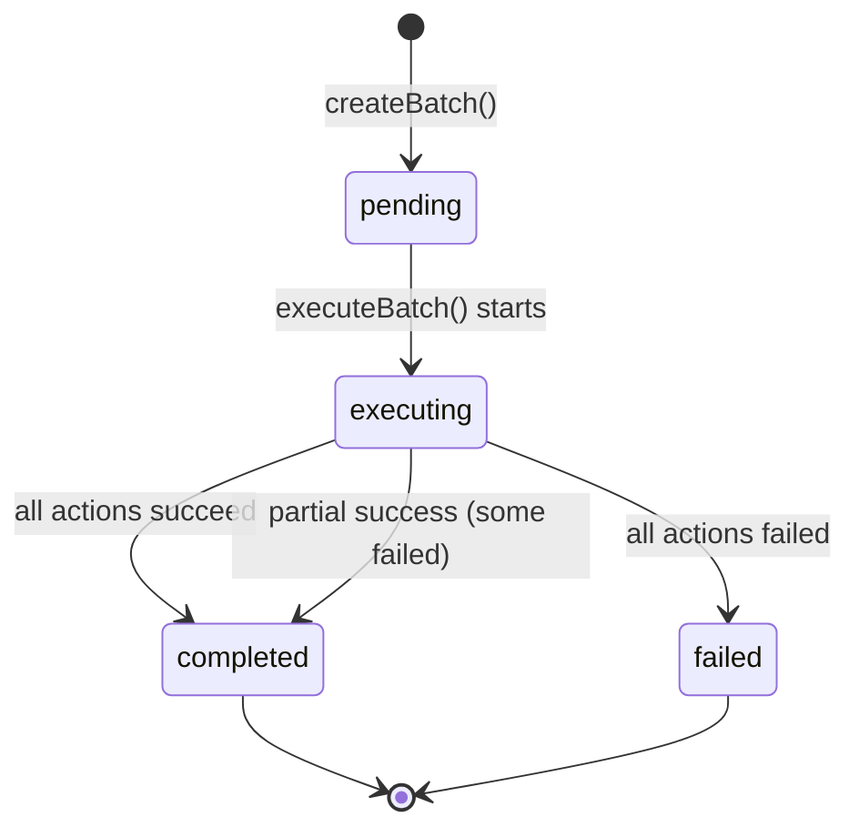

---

## CI/CD Optimization Strategies

### Strategy 1: Commit Squashing

**Problem**: N commits = N CI runs  
**Solution**: Squash commits within window into single commit

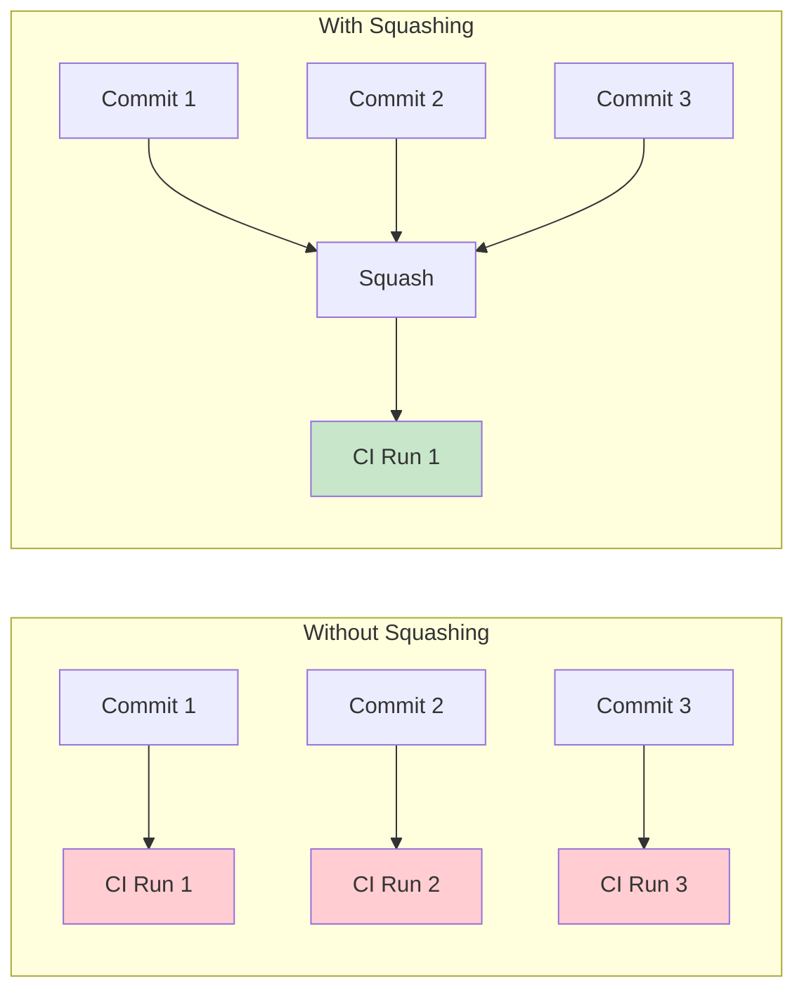

**Savings**: ~67% reduction (3 runs → 1 run)

### Strategy 2: Push Deduplication

**Problem**: Multiple agents push to same branch  
**Solution**: Merge push requests, execute once

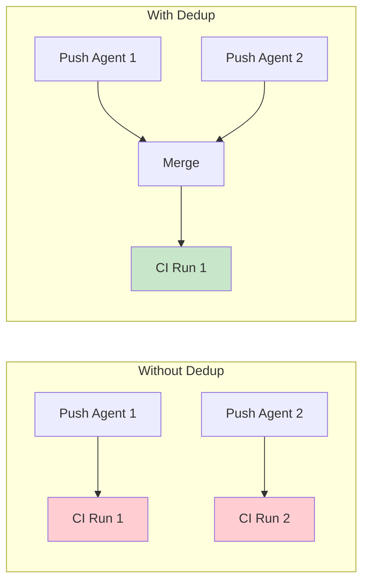

### Strategy 3: Workflow Trigger Batching

**Problem**: Redundant workflow dispatches  
**Solution**: Deduplicate identical workflow triggers

### Strategy 4: Time-Window Batching

**Problem**: Rapid-fire actions trigger multiple pipelines  
**Solution**: Delay execution to collect related actions

```mermaid
gantt
    title Action Batching Timeline
    dateFormat X
    axisFormat %s

    section Without Batching
    Action 1    :a1, 0, 1
    CI Run 1    :crit, ci1, 1, 6
    Action 2    :a2, 3, 1
    CI Run 2    :crit, ci2, 4, 9
    Action 3    :a3, 5, 1
    CI Run 3    :crit, ci3, 6, 11

    section With Batching (30s window)
    Action 1    :a1b, 0, 1
    Action 2    :a2b, 3, 1
    Action 3    :a3b, 5, 1
    Window      :active, w, 0, 30
    Batch CI    :done, bci, 30, 35
```

---

## CLI Integration

The `DeployBatcher` is exposed through the CLI:

```bash
# Queue a commit
uam deploy queue --agent-id <id> --action-type commit --target main \
  --message "feat: new feature" --files "src/feature.ts"

# Queue a push
uam deploy queue --agent-id <id> --action-type push --target main

# Queue a workflow trigger
uam deploy queue --agent-id <id> --action-type workflow --target test.yml \
  --ref main --inputs '{"env":"staging"}'

# View status
uam deploy status

# Create batch manually
uam deploy batch

# Execute specific batch
uam deploy execute --batch-id <uuid>

# Flush all pending
uam deploy flush
```

### CLI Command Flow

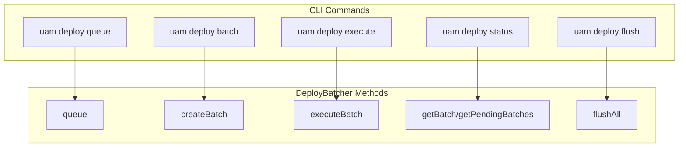

---

## Usage Examples

### Example 1: Multi-Agent Commit Batching

```typescript
import { DeployBatcher } from './coordination/deploy-batcher.js';

const batcher = new DeployBatcher({
  dynamicWindows: { commit: 30000 },  // 30s window
  parallelExecution: true,
});

// Agent 1 commits
await batcher.queue('agent-1', 'commit', 'main', {
  message: 'feat: add user auth',
  files: ['src/auth.ts', 'src/user.ts']
});

// Agent 2 commits (within window - will be merged)
await batcher.queue('agent-2', 'commit', 'main', {
  message: 'feat: add logging',
  files: ['src/logger.ts']
});

// After 30s, create and execute batch
const batch = await batcher.createBatch();
const result = await batcher.executeBatch(batch.id);

console.log(result);
// {
//   batchId: 'uuid',
//   success: true,
//   executedActions: 1,  // Squashed into single commit
//   failedActions: 0,
//   duration: 1234
// }
```

### Example 2: Urgent Deployment

```typescript
const batcher = new DeployBatcher();

// Enable urgent mode for critical fix
batcher.setUrgentMode(true);

// Queue with minimal delay
await batcher.queue('agent-1', 'commit', 'main', {
  message: 'hotfix: critical security patch',
  files: ['src/security.ts']
}, { urgent: true });

await batcher.queue('agent-1', 'push', 'main', {}, { urgent: true });

// Immediately flush
const results = await batcher.flushAll();

// Restore normal mode
batcher.setUrgentMode(false);
```

### Example 3: Bulk Queue with Transaction

```typescript
const batcher = new DeployBatcher();

// Queue multiple actions atomically
const ids = await batcher.queueBulk('agent-1', [
  { actionType: 'commit', target: 'main', payload: { message: 'feat: A' } },
  { actionType: 'commit', target: 'main', payload: { message: 'feat: B' } },
  { actionType: 'push', target: 'main' },
  { actionType: 'workflow', target: 'deploy.yml', payload: { ref: 'main' } },
]);

console.log(`Queued ${ids.length} actions`);
```

---

## Performance Characteristics

### Time Complexity

| Operation | Complexity | Notes |
|-----------|------------|-------|
| `queue()` | O(1) | Single INSERT |
| `queueBulk()` | O(n) | Transaction with n INSERTs |
| `createBatch()` | O(n log n) | SELECT + grouping + squashing |
| `executeBatch()` | O(n) sequential, O(n/p) parallel | p = maxParallelActions |
| `flushAll()` | O(b × n) | b batches, n actions each |

### Space Complexity

| Storage | Size |
|---------|------|
| Per action | ~500 bytes (JSON payload) |
| Per batch | ~100 bytes + action references |
| SQLite overhead | ~4KB per page |

### Recommended Limits

| Parameter | Default | Max Recommended |
|-----------|---------|-----------------|
| `maxBatchSize` | 20 | 100 |
| `maxParallelActions` | 5 | 10 |
| Queue depth | - | 1000 actions |

---

## Database Schema

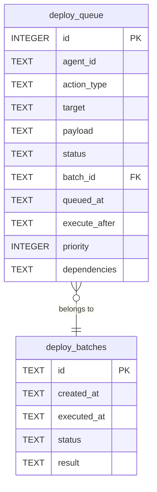

---

## Summary

The `DeployBatcher` provides a comprehensive solution for optimizing CI/CD pipeline usage in multi-agent environments:

| Feature | Benefit |
|---------|---------|
| Dynamic batch windows | Balances speed vs batching per action type |
| Commit squashing | Reduces N commits to 1 CI run |
| Action merging | Deduplicates redundant operations |
| Parallel execution | Faster batch completion |
| Urgent mode | Fast path for critical operations |
| SQLite persistence | Survives agent restarts |
| CLI integration | Easy manual control |

**Typical CI/CD savings**: 50-80% reduction in pipeline minutes for multi-agent workflows.
